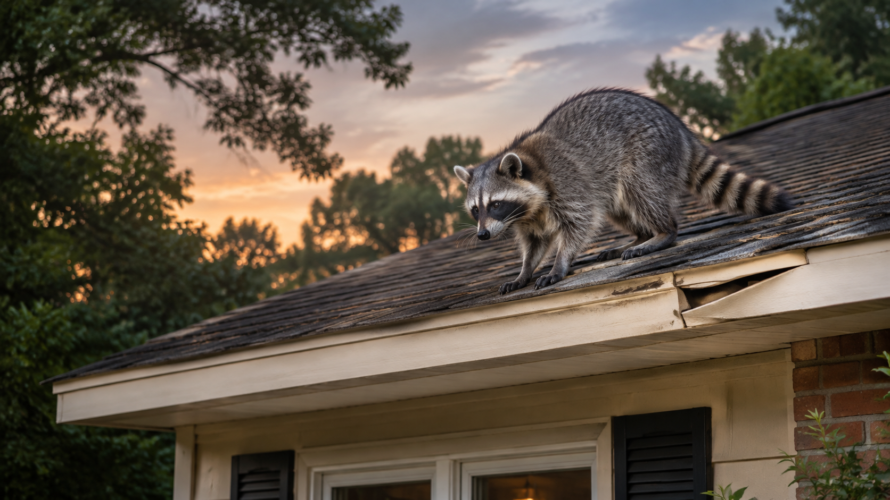

# Raccoons in Georgia: signs to check before fall

A noise above the ceiling. A loose panel at the roof edge. Trash scattered beside the bin. These clues can leave you wondering whether an animal has moved in—and what to do next.

Start with an inspection. A raccoon seen in the yard does not prove that one is living in your attic. The aim is to find out what is happening, protect the people who use the property, and make a plan that fits the problem.

*Original AI-generated image for this article. It does not show an ASAP customer property or completed job.*

## Why check your property now?

Late summer is a useful time to look over your property before fall. But raccoon activity is not limited to one month. Georgia’s Department of Natural Resources says raccoons are active throughout the year. They may use attics and other buildings as shelter. Outdoor pet food, gardens, and open trash bins can also draw them near homes. [Georgia DNR raccoon fact sheet (PDF)](https://georgiawildlife.com/sites/default/files/wrd/pdf/fact-sheets/2007_raccoon.pdf)

You do not need to wait for a season to change. If you hear repeated noises or see damage at an entry point, have the cause checked.

## Five signs worth checking

- **Sounds overhead:** repeated thumping, scratching, or chattering in the attic or chimney.
- **Changes at the roof edge:** loose soffit panels, damaged vents, or a fresh opening. A soffit is the panel under the roof’s edge.
- **Droppings in one spot:** a buildup on a deck, in an attic, or near a woodpile. Leave it alone while you arrange help.
- **Food sources disturbed:** trash bins opened, pet food eaten, or garden beds raided.
- **Repeated activity at one opening:** an animal seen entering or leaving the same gap.

These signs can have more than one cause. Share where and when you noticed them. Photos taken from a safe spot may help an inspector, but do not climb onto the roof to get them.

## Keep people and pets away from droppings

Raccoons sometimes return to the same place to leave droppings. This site is called a latrine. Droppings from an infected raccoon can contain roundworm eggs. People can become infected if they swallow those eggs, such as from dirty hands. Keep children and pets away from the area and avoid disturbing it. [CDC raccoon latrine guidance (PDF)](https://www.cdc.gov/parasites/baylisascaris/resources/raccoonlatrines.pdf)

Do not assume that spraying a disinfectant makes the area safe. The CDC says most chemicals do not kill raccoon roundworm eggs. Ask for a cleanup plan that fits the affected space and materials. [CDC prevention guidance](https://www.cdc.gov/baylisascaris/prevention/index.html)

Keep your distance from raccoons, too. If someone is bitten or scratched, wash the wound and seek prompt medical advice. A health professional should assess possible rabies exposure. [CDC rabies guidance](https://www.cdc.gov/rabies/prevention/index.html)

## What a removal plan should cover

### 1. Find the cause

The inspection should confirm the animal, locate active entry points, and check for young. Raccoon young can remain with their mother for months. Do not assume a den is empty because an adult has left. [Georgia DNR raccoon fact sheet (PDF)](https://georgiawildlife.com/sites/default/files/wrd/pdf/fact-sheets/2007_raccoon.pdf)

### 2. Plan removal and repairs

Ask how the animals will be handled and when openings can be closed. Ask how the work will meet current Georgia requirements. The removal plan should account for any young, and a hole should not be sealed while animals may still be inside. [Raccoon management guide (PDF), hosted by Georgia DNR](https://georgiawildlife.com/sites/default/files/wrd/pdf/management/Raccoons.pdf)

### 3. Address damage and cleanup

Ask which repairs and cleanup tasks are included. A written estimate should make the work, follow-up visits, and any warranty terms clear. The right scope depends on what the inspection finds.

### 4. Reduce reasons to return

Keep trash containers closed and put pet food away after feeding. Have vulnerable openings checked and repaired once they can be closed safely. These steps help reduce access to food and shelter. [CDC prevention guidance](https://www.cdc.gov/baylisascaris/prevention/index.html)

## Hear something above the ceiling?

Tell ASAP Pest & Wildlife Removal what you have seen or heard. Call to discuss an inspection and the next steps for your home or workplace.

**Call [770-691-3636](tel:+17706913636)** or visit [ASAP Pest & Wildlife Removal](https://removeasap.com/).
